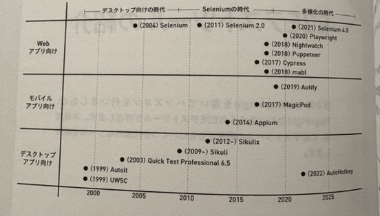
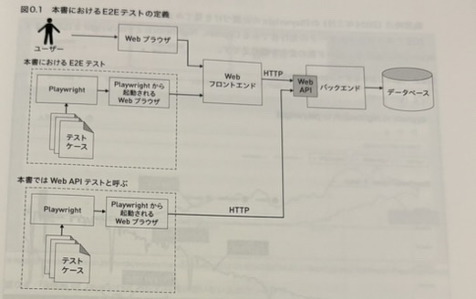
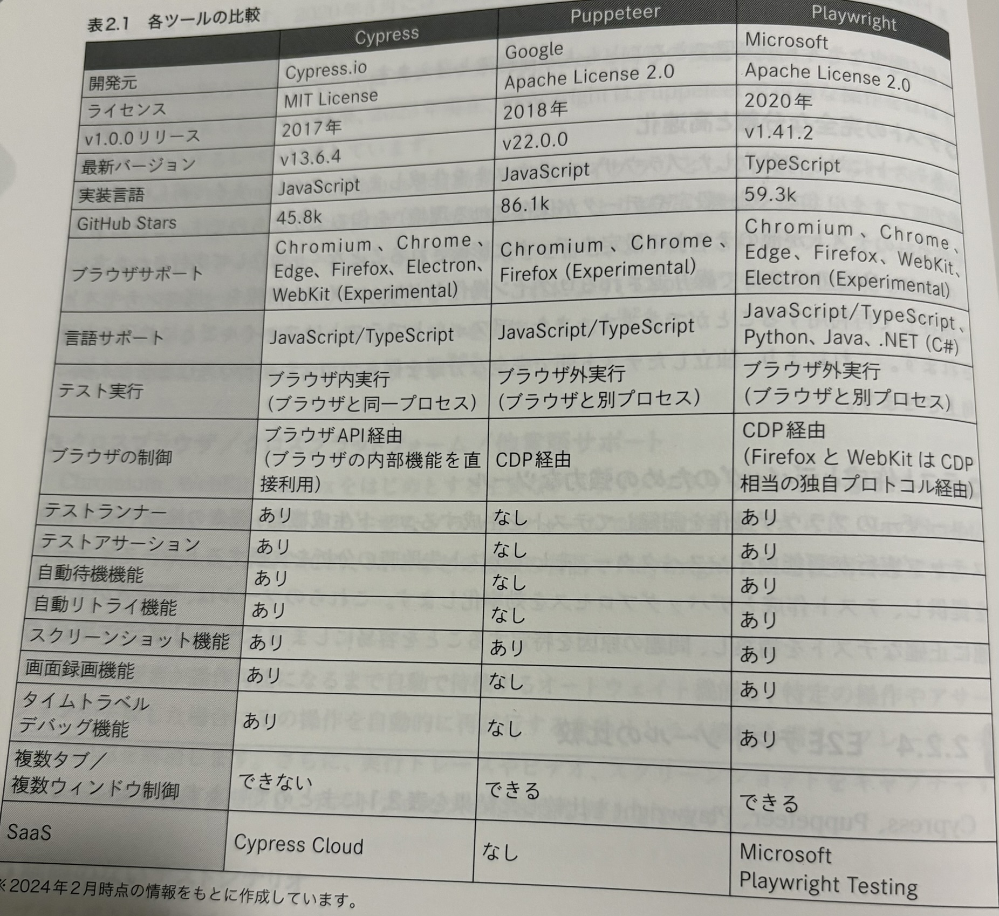
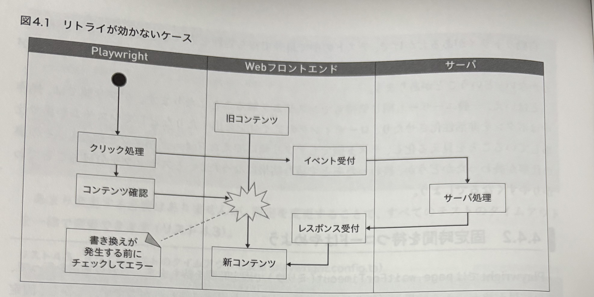
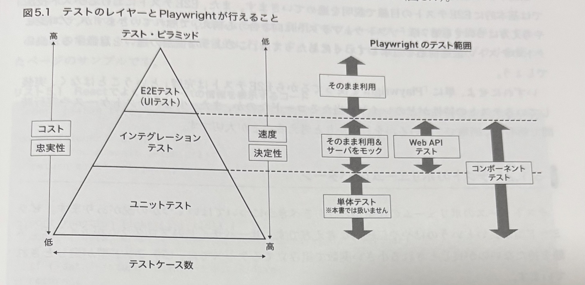
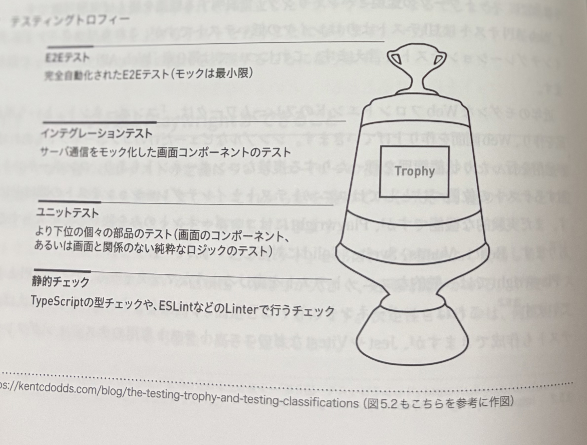
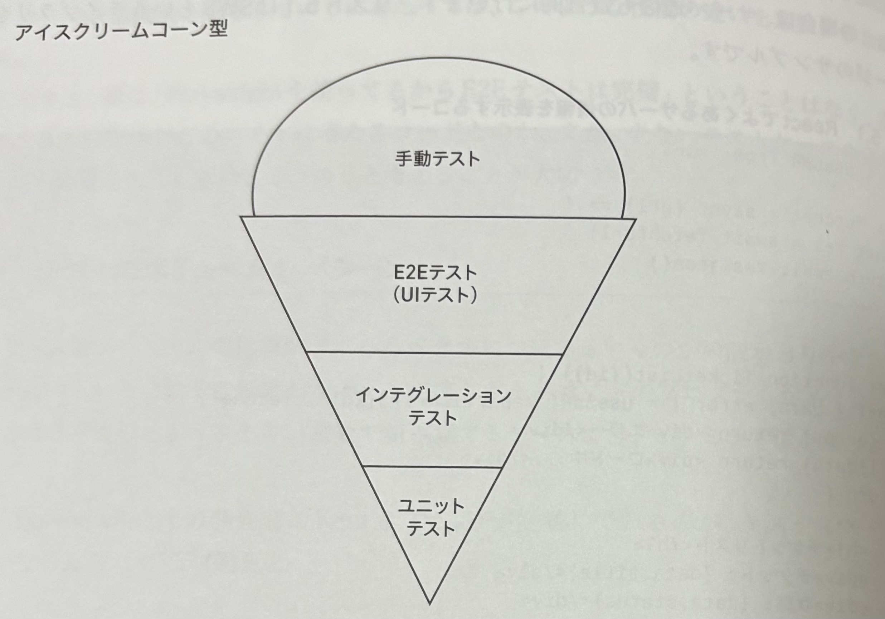

# Playwrightについて

[npm-trend](https://npmtrends.com/cypress-vs-playwright)

## 目次

- [VS Code拡張機能](#vs-code拡張機能)
- [E2Eテストツールの紹介](#e2eテストツールの紹介)
  - [Playwrightの歴史・変遷](#playwrightの歴史変遷)
  - [Playwrightの定義・概要](#playwrightの定義概要)
  - [E2Eテストの比較表](#e2eテストの比較表)
- [Playwrightの基本カテゴリー](#playwrightの基本カテゴリー)
  - [ナビゲーション](#ナビゲーション)
  - [ロケータ](#ロケータ)
  - [アクション](#アクション)
  - [マッチャー](#マッチャー)
- [リトライ挙動](#リトライ挙動)
- [何をテストとする？](#何をテストとする)
  - [テストのボリュームのパターン](#テストのボリュームのパターン)
  - [テスティングトロフィー/アイスクリーム](#テスティングトロフィーアイスクリーム)
- [準備・片付けコード](#準備片付けコード)
- [スクショとビデオについて](#スクショとビデオについて)
- [認証を伴うテスト](#認証を伴うテスト)
- [テストの7原則](#テストの7原則)
  - [テストレベル](#テストレベル)
  - [テストタイプ](#テストタイプ)
  - [テスト技法](#テスト技法)
- [テスト自動化の8原則](#テスト自動化の8原則)
- [参考情報](#その他参考情報)

## VS Code拡張機能

`ms-playwright.playwright`

## E2Eテストツールの紹介

### Playwrightの歴史・変遷



### Playwrightの定義・概要



### E2Eテストの比較表



## Playwrightの基本カテゴリー

大きく4つに分類できる:

- ナビゲーション
- ロケータ
- アクション
- マッチャー

### ナビゲーション

ページ遷移やページ情報の取得に関する操作

#### `goto()`

- 概要: 指定URLへ遷移し、既定でロード完了まで待機。
- 主な引数: `url: string`, `waitUntil?: 'load'|'domcontentloaded'|'networkidle'`, `timeout?: number`
- 例:

```ts
await page.goto("https://example.com", { waitUntil: "load" });
// 次の操作は描画安定後に行う
await expect(page).toHaveTitle(/Example/);
```

- 注意: SPAの遷移はXHRが続くことがあるため`networkidle`は長引く場合あり。

#### `waitForURL()`

- 概要: 現在URLが指定パターンに一致するまで待機（クリック後のリダイレクト等）。
- 受け付ける型: 文字列/正規表現/テンプレート (`'**/dashboard?tab=stats'` 等)
- 例:

```ts
await page.getByRole("link", { name: "詳細" }).click();
await page.waitForURL(/\/detail\/[0-9]+/);
```

- 注意: URL最終確認はアサーション（下記`toHaveURL`）で締めるとより明確。

#### `toHaveTitle()`と`toHaveURL()`

- 概要: 期待値に一致するまで暗黙的に待機しつつ検証する高レベルAPI。
- 例:

```ts
await expect(page).toHaveTitle(/Users? List/);
await expect(page).toHaveURL("https://app.example.com/dashboard");
```

- 使い分け: URL変化を待つ必要がある操作直後は`waitForURL`→最終確認で`toHaveURL`。

### ロケータ

ページ内の要素の特定

優先順位も含んでロケータを紹介する

1. `page.getByRole()`
   アクセシビリティ属性によって検索
1. `page.getByLabel()`
   ラベルテキストから検索
1. `page.getByPlaceholder()`
   placeholderから検索
1. `page.getByText()`
   テキストから検索
1. `page.getByAltText()`
   画像から検索
1. `page.getByTitle()`
   title属性から検索
1. `page.getByTestId()`
   testId属性から検索
1. `page.locator()`
   CSS/タグ/IDから検索

#### 注意

変更に強いテストを書く必要があり、むやみにCSSやtestIDを採番しない。

#### 高度なlocator フィルター

要素集合からさらに条件で絞り込む。

```ts
// リスト項目を取得して、テキストに「エラー」を含む項目のみ絞り込む
const items = page.getByRole("listitem");
const errorItems = items.filter({ hasText: "エラー" });
await expect(errorItems).toHaveCount(1);
await errorItems.first().click();

// 内部に特定の子要素を持つボタンだけに絞る（has）
const saveButtons = page
  .getByRole("button")
  .filter({ has: page.getByText("保存") });
await saveButtons.first().click();

// 特定のテキストを含まない要素に絞る（hasNotText）
const visibleRows = page.getByRole("row").filter({ hasNotText: "非表示" });
```

一度絞り込んだものをさらに検索する

親→子の順でチェーンして、対象を特定していく。

```ts
// テーブル → 行（氏名を含む） → その行内の「編集」ボタン
const table = page.getByRole("table", { name: "ユーザー一覧" });
const targetRow = table.getByRole("row", { name: /山本/ });
await targetRow.getByRole("button", { name: "編集" }).click();

// カード → ヘッダー → アクションアイコン
const card = page.getByRole("article", { name: "請求情報" });
await card.getByRole("heading", { name: "請求情報" }).click();
await card.getByRole("button", { name: "詳細" }).click();
```

#### 高度なlocator 複数要素の絞り込み

複数条件を段階的に適用して、交差集合を作る。

```ts
// 行のうち「有効」セルを持ち、かつ「山本」を含む行だけに絞る
const rows = page.getByRole("row");
const hasActive = rows.filter({
  has: page.getByRole("cell", { name: "有効" }),
});
const yamamotoActive = hasActive.filter({ hasText: "山本" });
await expect(yamamotoActive).toHaveCount(1);

// 入力欄のうち、プレースホルダが「メール」で、かつ必須表示（*）があるもの
const mailInputs = page
  .getByPlaceholder("メール")
  .filter({ has: page.locator("xpath=..").getByText("*") });
```

#### 高度なlocator `or()`や`and()`

条件の和集合・積集合を作る（Playwrightの`locator.or()`/`locator.and()`）。

```ts
// 「保存」または「更新」ボタンのどちらかがあればクリック（OR）
const saveOrUpdate = page
  .getByRole("button", { name: "保存" })
  .or(page.getByRole("button", { name: "更新" }));
await saveOrUpdate.first().click();

// 同じ行で「山本」と「有効」の両方を満たす要素（AND）
const rowLocator = page.getByRole("row");
const yamamoto = rowLocator.filter({ hasText: "山本" });
const active = rowLocator.filter({
  has: page.getByRole("cell", { name: "有効" }),
});
const yamamotoAndActive = yamamoto.and(active);
await expect(yamamotoAndActive).toHaveCount(1);
```

### アクション

ユーザ操作のシミュレート

#### キーボード操作

- 概要: 入力欄への文字入力やキー押下をシミュレート。
- 使用する関数: `fill()`, `clear()`,`type()`, `press()`,`pressSequentially()`
- 例:

```ts
await page.getByLabel("メール").fill("user@example.com");
await page.press("Enter");
```

#### チェックボックスやラジオボタンの操作

- 概要: 選択状態の切替や状態検証を行う。
- 使用する関数: `check()`, `uncheck()`, `isChecked()`
- 例:

```ts
await page.getByLabel("利用規約に同意").check();
await expect(page.getByLabel("利用規約に同意")).toBeChecked();
```

#### セレクトボックスの操作

- 概要: プルダウンの値選択をシミュレート。
- 使用する関数: `selectOption()`
- 例:

```ts
await page.getByLabel("都道府県").selectOption("tokyo");
await expect(page.getByLabel("都道府県")).toHaveValue("tokyo");
```

#### マウス操作

- 概要: ホバー・クリックなどのポインタイベントを再現。
- 使用する関数: `locator.hover()`, `locator.click()`, `locator.dblclick()`, `locator.dragTo()`
- 例:

```ts
await page.getByRole("button", { name: "保存" }).hover();
await page.getByRole("button", { name: "保存" }).click();
```

#### フォーカス

- 概要: 要素へのフォーカス移動やフォーカス状態の検証。
- 使用する関数: `locator.focus()`, `locator.blur()`
- 例:

```ts
await page.getByPlaceholder("検索").focus();
await expect(page.getByPlaceholder("検索")).toBeFocused();
```

### マッチャー

選択された要素の状態が期待と一致しているかテスト

#### `toContainText()`, `toHaveText()`, `toBeVisible()`, `toBeAttached()`

- 概要: テキストの部分/完全一致、可視性、DOMへの接続状態を検証。
- 使用する関数: `toContainText()`, `toHaveText()`, `toBeVisible()`, `toBeAttached()`
- 例:

```ts
await expect(page.getByRole("alert")).toContainText("エラー");
await expect(page.getByTestId("avatar")).toBeVisible();
```

#### `not`

- 概要: 条件の否定を表現して期待しない状態を検証。
- 使用する関数: `expect(locator).not.xxx`
- 例:

```ts
await expect(page.getByRole("alert")).not.toBeVisible();
await expect(page.getByText("完了")).not.toBeHidden();
```

#### `toBeChecked()`

- 概要: チェックボックス/ラジオが選択状態かを検証。
- 使用する関数: `toBeChecked()`
- 例:

```ts
await page.getByLabel("利用規約に同意").check();
await expect(page.getByLabel("利用規約に同意")).toBeChecked();
```

#### `toBeDisabled()`, `toBeEnabled()`

- 概要: 要素の無効/有効状態を検証。
- 使用する関数: `toBeDisabled()`, `toBeEnabled()`
- 例:

```ts
await expect(page.getByRole("button", { name: "保存" })).toBeDisabled();
await expect(page.getByRole("button", { name: "編集" })).toBeEnabled();
```

#### `toBeEmpty()`, `toBeHidden()`

- 概要: 要素が空（子要素なし）/非表示であることを検証。
- 使用する関数: `toBeEmpty()`, `toBeHidden()`
- 例:

```ts
await expect(page.getByTestId("result")).toBeEmpty();
await expect(page.getByText("読み込み中")).toBeHidden();
```

#### `toBeFocused()`

- 概要: 要素がフォーカスを持っていることを検証。
- 使用する関数: `toBeFocused()`
- 例:

```ts
await page.getByPlaceholder("検索").focus();
await expect(page.getByPlaceholder("検索")).toBeFocused();
```

#### `toHaveCount()`

- 概要: ロケータで取得した要素の件数が一致することを検証。
- 使用する関数: `toHaveCount()`
- 例:

```ts
await expect(page.getByRole("row")).toHaveCount(10);
await expect(page.getByText(/エラー/)).toHaveCount(1);
```

#### `toHaveValue()`, `toHaveValues()`

- 概要: 入力値/複数選択値が期待通りであることを検証。
- 使用する関数: `toHaveValue()`, `toHaveValues()`
- 例:

```ts
await expect(page.getByLabel("都道府県")).toHaveValue("tokyo");
await expect(page.getByLabel("タグ")).toHaveValues(["bug", "feature"]);
```

## リトライ挙動

タイムアウトを安易に伸ばすのは避ける（実行時間が伸びるため）。

固定時間を待つコードはフレーキーなテストになるため避ける。



### 特定のイベントを待つメソッド

- `waitForResponse()`
  特定のAPIが呼ばれるまで待つ
- `waitForURL()`
  URLが変更されるまで待つ
- `waitForLoadState()`
  DOMページのロードイベントを待つ
- `waitForRequest()`
  リクエストを待つ
- `waitForFunction()`
  関数がtrueを返すのを待つ
- `waitForEvent()`
  多岐にわたるイベントを待つ

## 何をテストとする？

E2Eテストはユニットテストよりもテストケースが大きくなる。

### テストのボリュームのパターン



#### テスティングトロフィー



#### アイスクリーム



## 準備・片付けコード

```ts
test.beforeAll();

test.beforeEach();

test.afterAll();

test.afterEach();
```

`Each()`はテストケースごとに呼ばれる

`All()`は全部のテストもしくはテストスイートの前後で呼ばれる

### 実行時順序

1. beforeAll
1. beforeEach
1. test
1. afterEach
1. afterAll

## スクショとビデオについて

### スクショ

- `path`: 保存先ファイル名
- `fullPage`: true: ページ全体をキャプチャ（falseの場合はビューポートのみ）

```
await page.screenshot({ path: 'screenshot.png', fullPage: true });

```

#### 特定の箇所のスクショ

```ts
const element = await page.$("#my-element");
await element.screenshot({ path: "element.png" });
```

### ビデオ録画

```ts
// playwright.config.ts
export default defineConfig({
  use: {
    video: "on",
  },
});
```

- on
  テストごとに録画
- off
  録画なし
- retain-on-failure
  テストごとに録画、成功したときはすべて削除
- on-first-retry
  テストを初めて再試行する場合のみ録画

```ts
// コンテキスト作成時にビデオ設定
const context = await browser.newContext({
  recordVideo: {
    dir: "videos/", // 保存先ディレクトリ
    size: { width: 1280, height: 720 }, // オプション: 動画サイズ
  },
});
const page = await context.newPage();

// テスト終了後にビデオを保存
await page.close();
const videoPath = await page.video().path();
console.log(`Video saved at: ${videoPath}`);
```

## 認証を伴うテスト

### フェイク認証

MSAL.jsを利用する（Microsoft EntraID）

署名用の鍵を作成する `mkjwk.org`

`jwt.io`でJWTを作成する

## テストの7原則

1. テストは欠陥があることは示せるが、欠陥がないことは示せない
1. 全数テストは不可能
1. 早期テストで時間とコストを節約
1. 欠陥の偏在
1. テストの弱化
1. テストはコンテキスト次第
1. 欠陥ゼロの落とし穴

上記７原則を踏まえて実際のテスト設計は以下3つになる

1. テストレベル
1. テストタイプ
1. テスト技法

### テストレベル

- コンポーネントテスト(Unit)
- コンポーネント統合テスト
- システムテスト（E2Eテストや一部非機能テスト）
- システム統合テスト
- 受け入れテスト

### テストタイプ

- 機能テスト
- 非機能テスト
- ブラックボックステスト
- ホワイトボックステスト

ISTQBで定義されているのは4つある

### テスト技法

- 同値分割法
- 境界値分析
- デシジョンテーブルテスト
- 状態遷移テスト
- ユースケーステスト

## テスト自動化の8原則

1. 手動テストはなくならない
1. 手動でおこなって効果のないテストを自動化しても無駄である
1. 自動テストは書いたことしかテストしない
1. テスト自動化の効用はコスト削減だけではない
1. 自動テストシステムの開発は継続的におこなうものである
1. 自動化検討はプロジェクト初期から
1. 自動テストで新種のバグが見つかることは稀である
1. テスト結果分析という新たなタスクが生まれる

## その他参考情報

npm init playwright

webkitを利用する事が可能

[公式-next](https://ja.next-community-docs.dev/docs/app/building-your-application/testing/playwright)

[公式-playwright](https://playwright.dev/docs/test-use-options)

[参考サイト](https://devlog.mescius.jp/playwright-quickstart/)

[使い方](https://qiita.com/miruon/items/579d02eb26834259f034)
